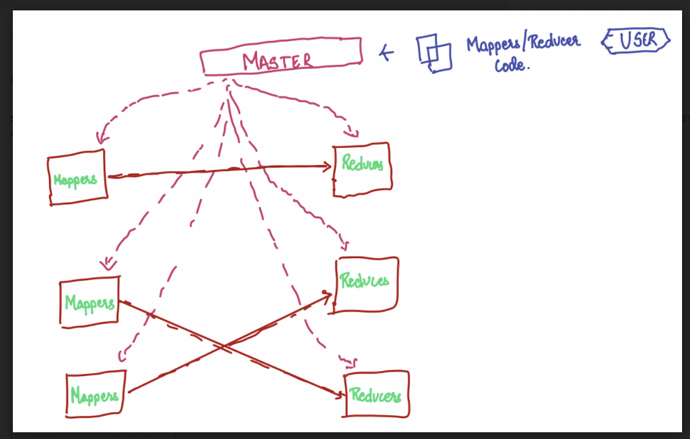
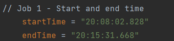
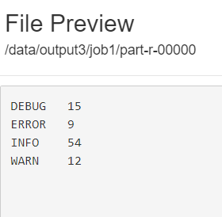
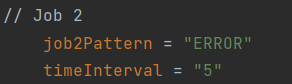
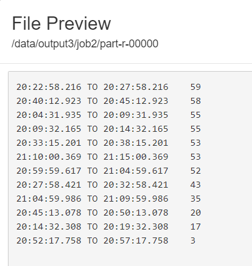
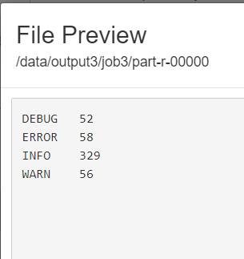
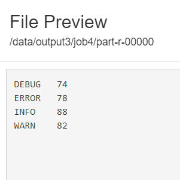
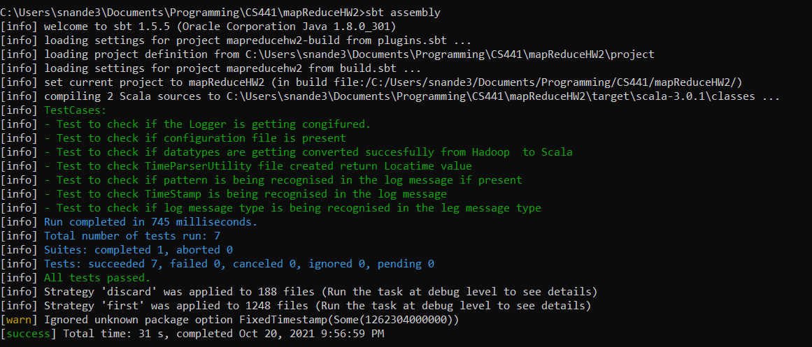

# Distribution Computation Problem (HW-2)
### Description: The goal of this homework is for students to gain experience with solving a distributed computational problem using cloud computing technologies.
( CS441 | Fall 2021 )
## Name: Samihan Nandedkar
### UIN: 667140409

### Output

* Please refer to docs directory to get the latest jar file and input log file. 
* All the jobs are run sequentially using the same driver class. `DriverClass`
* The output files will be created in the given folder through arguments in job1, job2, job3, job4 respectively.

To Run the MapReduce job,
* HortonWorks Sandbox
1. Place the input file in HDFS. 
2. Create a custom jar from this project. (Steps are given below.)
3. Run the following commands start the jobs. 
  ```
  hadoop jar <jar-file-name> <input directory path> <Output directory path>
  ``` 
* AWS EMR
1. Place the input file in S3 bucket.
2. Create a EMR Cluster
3. Place the jar file in EMR CLuster.
4. Create a new step with our jar file. And pass the location of input file and output path as arguments. 

### Environment Setup
We will try to explore the MapReduce tasks in our local Hadoop framework, HortonWork Sandbox and AWS EMR.

### Local Hadoop Setup
* Please follow the given guide to install Hadoop on you local system. [Link](https://www.datasciencecentral.com/profiles/blogs/how-to-install-and-run-hadoop-on-windows-for-beginners)

#### HortonWork Sandbox.

* The Sandbox is a straightforward, pre-configured, learning environment that contains the latest developments from Apache Hadoop Enterprise, specifically Hortonworks Data Platform (HDP) Distribution.
* Install VMware Workstation Pro / VirtualBox on your system.
* Download the required sandbox virtual machine for this [link](https://www.cloudera.com/downloads/hortonworks-sandbox.html?utm_source=mktg-tutorial).
* Import virtual Machine into VMware Workstation Pro / Virtual Box. 
* Start the Virtual Machine. 
* Please refer to [this](https://www.cloudera.com/tutorials/sandbox-deployment-and-install-guide/2.html) guide for in depth procedure for the setup.

### Amazon Web Services EMR
* AWS EMR is a managed cluster platform that simplifies running big data frameworks, such as Apache Hadoop and Apache Spark , on AWS to process and analyze vast amounts of data.
* It requires a custom Jar file and the input to be placed in S3 storage to start the task. 

### Compile and Create Jar
The project can be compiled to create jar using the following procedure.
* Through Command Line
  * Clone the following repository in your system.
  * On command line please navigate to the following repository. And run the following commands to compile and run the code. 
  ```
  sbt clean compile test
    ``` 
    ```
  sbt assembly
    ```
A .jar file should be created in /target/scala-3.01/project name.jar
  
### Project Structure
#### Driver
`DriverClass` contains the configuration of all the MapReduce jobs to be executed. This class is called whenever the 
jar is executed in hadoop.

#### Mappers
Package: com.samihann.mappers

This package contains all the mappers required for all the jobs: 
`JobOneMapper`, `JobTwoMapper`, `JobTwoMapper`, `JobThreeMapper`.

#### Reducers
Package: com.samihann.reducers

This package contains all the reducers required for all the jobs:
`JobOneReducers`, `JobTwoReducers`, `JobTwoReducers`, `JobThreeReducers`

#### Utility
Package: com.samihann.Utility

#### Configuration

The configuration.conf file contains the parameters which are used in the code.

This package contains all the utility functions which are reused across the jobs such as parsing task. 

### Hadoop Map Reduce

* Hadoop is a framework that allows us to store and process large data sets in parallel and distributed fashion.
* There are major two components of a Hadoop framework. 
  * Storage: HDFS - Distributed file system. (Hadoop Cluster)
  * MapReduce - Parallel and distributed processing.
* HDFS: It is the primary data storage system under Hadoop applications.
  * NameNode:
    * Receives heartbeat and block report from DataNode
    * Records metadata
  * DataNode: 
    * Stores actual data.
    * Handles servers read and write request.
* MapReduce:
  * Mappers: User designated code which gives a out of Key Value pair. 
  * Reducers: User designated code which takes input of key and list[Values] pair and give our a key value pair according to logic defined. 
  
## Jobs

In this project we have used Hadoop MapReduce to perform the below mentioned tasks. 

1. **Job 1:** 
* **Compute the distribution of different types of messages across predefined time intervals and injected string instances of the designated regex pattern for these log message types.**

   * Mapper: `JobOneMapper`: [Open](/src/main/scala/com/samihann/mappers/JobOneMapper.scala)
   * Reducer: `JobOneReducer`: [Open](/src/main/scala/com/samihann/reducers/JobOneReducer.scala)
   
Logic:

The Mapper will do the task of parsing through the file to do the following three checks
* Check if the message lies in the specifies time interval.
* Check the message type and designate the type as _key_
* Check if the message contains the given regex patter, if it does give One(IntWritable) in _value_

The reducer will go over all the values for a message type and add the using foldLeft function to iterate through it.

Output:

In the configuration.conf, the start time and end time is mentioned as below.


The mapreduce job is showing the output for the message grouped by their type in this time frame.



2. **Job 2:** 
* **Compute time intervals sorted in the descending order that contained most log messages of the type ERROR with injected regex pattern string instances.**
* Mapper: `JobTwoMapper`: [Open](/src/main/scala/com/samihann/mappers/JobTwoMapper.scala)
* Reducer: `JobTwoReducer`: [Open](/src/main/scala/com/samihann/reducers/JobTwoReducer.scala)

Logic: 

The Mapper will do the task of parsing through the file to do the following task
* On the first iteration it will set start-time as log time and end-time as start-time + 5 mins.
* Designate the time interval as _key_
* Check if the message type is ERROR and contains the given regex patter, if it does give One(IntWritable) in _value_

The reducer will go over all the values for a interval and add the using foldLeft function to iterate through it.

Output:

In the configuration.conf, the duration is mentioned as below.


The mapreduce job will show the output for the message grouped by their time interval.




4. **Job 3:** 
* **Produce the number of the generated log messages for each message type.**
* Mapper: `JobThreeMapper`: [Open](/src/main/scala/com/samihann/mappers/JobThreeMapper.scala)
* Reducer: `JobThreeReducer`: [Open](/src/main/scala/com/samihann/reducers/JobThreeReducer.scala)

Logic:

The Mapper will do the task of parsing through the file to do the following task
* In the log message check if the message type.
* Designate the type as _key_
* Check all the messages of a particular type contains the given regex patter, if it does give One(IntWritable) in _value_

The reducer will go over all the values for a interval and add the using foldLeft function to iterate through it.

Output:

The mapreduce job will show the output for the message grouped by their type.



5. Job 4: 
* **Produce the highest number of characters in log message for each log message type that contain the detected instances of the designated regex pattern.**
* Mapper: `JobFourMapper`: [Open](/src/main/scala/com/samihann/mappers/JobFourMapper.scala)
* Reducer: `JobFourReducer`: [Open](/src/main/scala/com/samihann/reducers/JobFourReducer.scala)

Logic:

The Mapper will do the task of parsing through the file to do the following task
* In the log message check if the message type.
* Designate the type as _key_
* Check all the messages of a particular type contains the given regex patter, if it does count the characters in message and send the count as _value_

The reducer will go over all the values for a interval and find the maximum character count using foldLeft function to iterate through it.

Output:

The mapreduce job will show the output of hight character count for the messages grouped by their type.




### Test Cases

* Through Command Line
  * Clone the following repository in your system.
  * On command line please navigate to the following repository. And run the following commands to compile and run the test cases.
  
  ```
  sbt clean compile test
    ``` 




### References

* https://github.com/0x1DOCD00D/LogFileGenerator
* https://www.cloudera.com/
* https://aws.amazon.com/education/awseducate/
* https://hadoop.apache.org/docs/r1.2.1/mapred_tutorial.html


